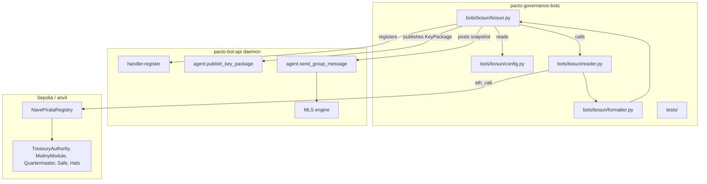

# Python Governance Snapshot Bot — Standalone Repo

**Target repo:** `logicminds/pacto-governance-bots` (new public GitHub repo, cloned locally at `~/projects/pacto-governance-bots`). This plan is written in `pacto-bot-api` but describes work in that target repository.

## Summary

Create the `bosun` governance snapshot bot in a new standalone Python repository. Start from `pacto-bot-admin new --scaffold bosun`, replace the scaffolded command-handler body with a `/snapshot` command and a daily cadence task, add `web3.py`-based Pacto-gov contract reads, and format the output as Markdown before posting via `agent.send_group_message`. Phase 2 inbound `!snapshot` invocation is deferred; Phase 1 tests the `/snapshot` handler with an external trigger.

## Problem Frame

The governance snapshot pattern is proven in Rust inside `pacto-bot-api` (`crates/governance-bot/`), but Python is the intended first-class authoring surface for Pacto bot handlers. A standalone Python repo decouples the bot from the daemon's Rust release cycle and lets operators clone, configure, and run a Python project without Rust tooling. The existing scaffold generates command-driven bots; this plan adapts the scaffold to a cadence-driven governance poster.

## Requirements

### Functional behavior

R1. Bot identity is `bosun`, created with `pacto-bot-admin` and configured in `pacto-bot-api.toml` before the bot starts.
R2. On startup, the bot publishes its MLS KeyPackage via `agent.publish_key_package` so it can be invited to a Squad.
R3. The bot reads public Pacto-gov state from a configurable RPC endpoint (Sepolia chain ID 11155111 or anvil chain ID 31337).
R4. The bot formats a Markdown snapshot covering active proposals, upcoming deadlines, treasury balances, active mutinies, captain/crew state, and suggested prompts.
R5. The bot posts the snapshot daily to a configured MLS Squad channel via `agent.send_group_message`.
R6. The bot posts autonomously; no human-paste fallback.
R7. Cadence and RPC config live in the handler, not the daemon config.

### Python SDK and architecture

R8. Built on the Python SDK's `Bot` class. The bot registers with the daemon and uses the underlying `PactoClient` for `agent.publish_key_package` and `agent.send_group_message`.
R9. Connection retry and circuit-breaker behavior come from the `Bot` class's built-in `RetryCircuit` loop.
R10. The bot implements a `/snapshot` command handler with the `Bot` decorator API. The daily cadence calls the same handler logic.

### Repository and scaffolding

R11. The repository is created as `logicminds/pacto-governance-bots` on GitHub, public, and cloned locally to `~/projects/pacto-governance-bots`.
R12. The project is scaffolded with `pacto-bot-admin new --scaffold bosun` so the generated Python SDK and base handler structure are present.
R13. The repository includes a `README.md` with setup, run, and test instructions.
R14. For local development, commands are documented relative to `~/projects/pacto-governance-bots`.

### Configuration and compatibility

R15. The Python bot uses the same env vars as the Rust governance crate, including `PACTO_GOVERNANCE_RPC_URL`, `PACTO_GOVERNANCE_BOT_ID`, `PACTO_GOVERNANCE_GROUP_ID`, `PACTO_GOVERNANCE_DAEMON_SOCKET`, `PACTO_GOVERNANCE_DAEMON_HTTP`, `PACTO_GOVERNANCE_HTTP_SECRET`, `PACTO_GOVERNANCE_SQUAD_INDEX`, `PACTO_GOVERNANCE_CADENCE_SECONDS`, `PACTO_GOVERNANCE_CAPTAIN`, `PACTO_GOVERNANCE_CREW_CANDIDATES`, `PACTO_GOVERNANCE_PROPOSER_CANDIDATES`, `PACTO_GOVERNANCE_REGISTRY`, and `PACTO_GOVERNANCE_HATS`. Python-native conveniences like `.env` loading are allowed but must not change the env var surface.

### Testing and quality

R16. Unit tests for the on-chain reader and Markdown formatter run without a live daemon, anvil, or relay.
R17. An integration test or documented manual procedure exercises the full flow against a running daemon and deployed squad; it is gated and does not run in the default test suite.
R18. No production secrets are committed, logged, or returned in error messages.

## Key Technical Decisions

- **Use the `Bot` class with a small subclass to expose the internal run loop for `asyncio.gather`.** The public `Bot.run()` calls `asyncio.run(self._run())`, which is blocking and prevents a separate cadence task from sharing the event loop. A subclass in the target repo adds a public `run_async()` method that delegates to `Bot._run()`, allowing `asyncio.gather(bot.run_async(), cadence_loop())`. This keeps the `Bot` class's reconnection/circuit logic (R9) and its decorator API while supporting the cadence timer.
- **`/snapshot` handler implemented in Phase 1, daily cadence calls it.** The daily cadence task invokes the same `snapshot()` coroutine that the `@bot.command("/snapshot")` handler invokes. This makes Phase 2 a small increment: register `ReceiveGroupMessages` and route the inbound event to the existing handler. (see origin: R10, Phase 2 write-up)
- **Use `web3.py` v7+ with `AsyncWeb3` and `AsyncHTTPProvider`.** The Rust bot uses `alloy::sol!` bindings; there is no Python EVM pattern in this repo. `web3.py` v7 with `AsyncContract` objects is the standard Python path for read-only contract calls and supports the concurrent `eth_call` pattern needed for the snapshot. (see Sources & Research)
- **Keep the scaffold's `bots/bosun/` layout.** The `pacto-bot-admin` scaffold generates a multi-bot directory structure. The standalone repo keeps that layout so it remains compatible with future scaffold invocations and matches the template's assumptions. (see origin: R12)
- **Configuration via `pydantic-settings` with the Rust env var surface.** This gives Python-native validation and defaults while preserving the same environment variable names documented in `crates/governance-bot/README.md`. (see origin: R15)

## High-Level Technical Design

The bot entry point (`bots/bosun/bosun.py`) creates a small subclass of `Bot` that exposes an async `run_async()` method, registers the `/snapshot` command, and runs the dispatch loop and the daily cadence task together with `asyncio.gather`. The `/snapshot` handler and the cadence task both call a shared `snapshot()` coroutine. That coroutine reads governance state, formats it, and sends it via `bot.client.agent_send_group_message`.

## Implementation Units

### U1. Create the GitHub repository and local clone

**Goal:** Create the public repository and clone it to the local development path.

**Requirements:** R11, R14

**Dependencies:** none

**Files:**
- `~/projects/pacto-governance-bots/` (target repo root)

**Approach:** Use `gh repo create logicminds/pacto-governance-bots --public` and `gh repo clone logicminds/pacto-governance-bots ~/projects/pacto-governance-bots`. The repo starts empty; the next unit populates it with the scaffold.

**Test scenarios:**
- Happy path: repository is public on GitHub and cloneable via SSH/HTTPS.
- Error path: if the repo name already exists, the plan is paused for a rename decision.

**Verification:** `git remote -v` in `~/projects/pacto-governance-bots` points to `https://github.com/logicminds/pacto-governance-bots`.

### U2. Scaffold the Python project with `pacto-bot-admin`

**Goal:** Generate the base Python handler project using the admin CLI.

**Requirements:** R12, R8

**Dependencies:** U1

**Files:**
- `pyproject.toml`
- `README.md`
- `.env.example`
- `bots/bosun/bosun.py`
- `bots/bosun/tests/`
- `AGENTS.md`
- `systemd.service`
- `Dockerfile`

**Approach:** From `~/projects/pacto-governance-bots`, run `pacto-bot-admin new --scaffold bosun --backend nsec --relays ws://localhost:7000 --commands snapshot`. This resolves the template from `pacto-bot-templates`, renders the `cargo-generate` template, and writes the project structure. The default `llm` kind template produces a command-driven bot; the next units replace the command body with governance logic. Keep the generated `pyproject.toml`, `README.md`, `.env.example`, and `AGENTS.md` as starting points.

**Patterns to follow:** `src/scaffold/generate.rs` for the scaffold flow; `tests/fixtures/templates/python-llm/` for the expected generated shape.

**Test scenarios:**
- Happy path: `pacto-bot-admin new --scaffold bosun` completes without errors and produces a runnable Python project.
- Happy path: `python -m bots.bosun.bosun` or the generated entry point runs and connects to the daemon (with the default scaffold behavior).
- Error path: if the template resolution fails, the error message is surfaced and the plan is paused.

**Verification:** The generated `bots/bosun/bosun.py` contains a `Bot(bot_id="bosun")` and a command decorator; `pyproject.toml` declares the scaffolded Python SDK dependency.

### U3. Implement the configuration layer

**Goal:** Load and validate the same environment variables used by the Rust governance bot, using Python-native tooling.

**Requirements:** R15

**Dependencies:** U2

**Files:**
- `bots/bosun/config.py`
- `bots/bosun/__init__.py`
- `.env.example`

**Approach:** Use `pydantic-settings` with a `Settings` class that maps env vars to typed fields. The env var names match the Rust bot exactly: `PACTO_GOVERNANCE_RPC_URL`, `PACTO_GOVERNANCE_BOT_ID`, `PACTO_GOVERNANCE_GROUP_ID`, `PACTO_GOVERNANCE_DAEMON_SOCKET`, `PACTO_GOVERNANCE_DAEMON_HTTP`, `PACTO_GOVERNANCE_HTTP_SECRET`, `PACTO_GOVERNANCE_SQUAD_INDEX`, `PACTO_GOVERNANCE_CADENCE_SECONDS`, `PACTO_GOVERNANCE_CAPTAIN`, `PACTO_GOVERNANCE_CREW_CANDIDATES`, `PACTO_GOVERNANCE_PROPOSER_CANDIDATES`, `PACTO_GOVERNANCE_REGISTRY`, and `PACTO_GOVERNANCE_HATS`. Provide sensible defaults where the Rust bot has them (e.g., `SQUAD_INDEX=0`, `CADENCE_SECONDS=86400`). Sepolia infrastructure addresses are the defaults; anvil overrides use `PACTO_GOVERNANCE_REGISTRY` and `PACTO_GOVERNANCE_HATS`. Update `.env.example` with all variables and safe placeholder values.

**Patterns to follow:** Rust governance bot config at `crates/governance-bot/src/config.rs` for env var names and semantics; `pydantic-settings` for validation and `.env` loading.

**Test scenarios:**
- Happy path: `Settings()` loads from environment variables and returns typed values.
- Edge case: missing a required variable (`RPC_URL`, `BOT_ID`, `GROUP_ID`) raises a clear validation error.
- Edge case: comma-separated address lists (`CREW_CANDIDATES`, `PROPOSER_CANDIDATES`) parse into lists of checksum addresses.
- Edge case: default values match the Rust bot defaults (`SQUAD_INDEX=0`, `CADENCE_SECONDS=86400`).
- Edge case: `PACTO_GOVERNANCE_REGISTRY` and `PACTO_GOVERNANCE_HATS` override the Sepolia defaults for anvil testing.
- Edge case: invalid address in an override raises a clear validation error.

**Verification:** `pytest bots/bosun/tests/test_config.py` passes with mock env vars.

### U4. Implement the EVM reader

**Goal:** Read public Pacto-gov governance and treasury state from the configured RPC endpoint.

**Requirements:** R3, R4

**Dependencies:** U3

**Files:**
- `bots/bosun/reader.py`
- `bots/bosun/contracts.py`
- `bots/bosun/addresses.py`
- `bots/bosun/types.py` (optional, for typed snapshot data)

**Approach:** Use `web3.py` v7+ `AsyncWeb3` with `AsyncHTTPProvider`. Define ABI fragments for `INavePirataRegistry`, `ITreasuryAuthority`, `IMutinyModule`, `IQuartermaster`, and Hats `wearerStatus` in `bots/bosun/contracts.py`. Implement `GovernanceReader` in `reader.py` with an async `snapshot(squad_index)` method. The method discovers the squad via `registry.deploymentCount()`, `deploymentAt(i)`, and `deployment(topHatId)`, then reads proposals, mutinies, crew deadlines, treasury balances, and crew state. Sepolia infrastructure addresses live in `bots/bosun/addresses.py`; anvil addresses are loaded via env var override.

**Patterns to follow:** Rust governance reader in `crates/governance-bot/src/evm/reader.rs` and bindings in `crates/governance-bot/src/evm/bindings.rs` for the contract methods and data shape; `pacto-gov/deployments/11155111/full-system.json` for Sepolia addresses.

**Test scenarios:**
- Happy path: `reader.snapshot(0)` returns a `SnapshotData` object with all expected fields populated.
- Happy path: `reader.discover_squads()` returns a non-empty list when the registry has deployments.
- Edge case: `reader.discover_squads()` returns an empty list when `deploymentCount()` is zero.
- Edge case: no open proposals returns an empty proposals list, not an error.
- Error path: RPC endpoint unreachable raises a readable exception propagated to the caller.
- Error path: invalid `SQUAD_INDEX` (e.g., out of range for the registry's deployment count) raises a readable exception.
- Error path: RPC returns data for the wrong chain (e.g., Sepolia config pointing to anvil) does not silently produce garbage snapshot data.
- Integration: against an anvil node with a deployed squad, all snapshot fields are populated correctly (gated).

**Verification:** Unit tests pass with mocked `AsyncContract` calls; integration test passes against anvil with `PACTO_DEV_ENV=1`.

### U5. Implement the snapshot formatter

**Goal:** Format the structured governance data as Markdown suitable for posting to a Squad channel.

**Requirements:** R4

**Dependencies:** U4

**Files:**
- `bots/bosun/formatter.py`

**Approach:** Implement `format_snapshot(snapshot: SnapshotData) -> str` that mirrors the Rust formatter's sections: active proposals (with deadline, votes, captain status), upcoming crew deadlines, treasury balance summary, active mutinies, captain/crew state, and suggested discussion prompts. Keep the output deterministic and plain Markdown so it renders cleanly in an MLS group message.

**Patterns to follow:** Rust formatter in `crates/governance-bot/src/snapshot/format.rs` for section ordering and prompt derivation.

**Test scenarios:**
- Happy path: a snapshot with one proposal, one deadline, treasury balance, and no mutiny produces Markdown containing all sections.
- Edge case: a snapshot with zero proposals includes a "No active proposals" line.
- Edge case: an active mutiny is included; without one, the section is omitted or says "No active mutiny."
- Edge case: suggested prompts are derived from the data (e.g., upcoming deadline within 2 days).
- Edge case: Markdown special characters in proposal titles or addresses are escaped so the snapshot renders cleanly.
- Edge case: the formatted snapshot stays within a reasonable MLS group-message length limit.

**Verification:** `pytest bots/bosun/tests/test_formatter.py` passes for constructed `SnapshotData` inputs.

### U6. Implement the `/snapshot` command handler and daily cadence

**Goal:** Wire the snapshot flow into a `Bot` command handler and run it on a daily timer.

**Requirements:** R5, R8, R10

**Dependencies:** U2, U3, U4, U5, U7

**Files:**
- `bots/bosun/bosun.py`

**Approach:** Replace the scaffolded command handler body with a `Bot(bot_id="bosun", capabilities=["SendGroupMessages"], event_types=[])` instance. Define an async `snapshot()` helper that calls the reader and formatter, then sends via `await bot.client.agent_send_group_message(...)`. Register `@bot.command("/snapshot")` to call the same helper. The daily cadence is driven by the same `snapshot()` helper; it runs as a task alongside the `Bot` dispatch loop (see U7). Add a `--trigger-snapshot` CLI flag that bypasses the long-running cadence loop, connects to the daemon, optionally publishes the KeyPackage, calls `snapshot()` once, and exits. This gives operators a manual trigger for debugging and Phase 1 testing without waiting for the daily cadence or inbound MLS messages.

**Patterns to follow:** `python/examples/greeting_bot.py` for the `Bot` decorator API; Rust governance bot `SnapshotBot::run` for the cadence interval pattern.

**Test scenarios:**
- Happy path: `/snapshot` command returns a response that triggers an `agent.send_group_message` call and the daemon returns a hex event id.
- Happy path: daily cadence fires and calls the same `snapshot()` helper.
- Happy path: `--trigger-snapshot` runs once, posts the snapshot, and exits successfully.
- Edge case: `--trigger-snapshot` while the daemon is unreachable surfaces a clear error and exits non-zero.
- Edge case: cadence tick while the daemon is disconnected logs a warning and retries on the next tick without crashing.
- Error path: EVM read failure logs the error and the bot does not send a partial snapshot.
- Edge case: concurrent `/snapshot` command and cadence tick do not double-send or corrupt state.

**Verification:** `pytest bots/bosun/tests/test_bosun.py` passes with a mocked `PactoClient` and a manual external trigger for `/snapshot`. The `--trigger-snapshot` flag is verified manually against a running daemon.

### U7. Set up daemon client connection, KeyPackage publish, and cadence scheduling

**Goal:** Ensure the bot registers with the daemon, publishes its KeyPackage on startup, and runs the daily cadence in the same event loop as the `Bot` dispatch loop.

**Requirements:** R2, R5, R8, R9

**Dependencies:** U2, U3

**Files:**
- `bots/bosun/bosun.py`
- `.env.example`

**Approach:** The `Bot` class handles `handler.register` and reconnection. Because the public `Bot.run()` is a blocking `asyncio.run()` call, the target repo defines a small subclass that exposes the internal `_run()` coroutine as a public `run_async()` method. The entry point uses `asyncio.gather(bot.run_async(), cadence_loop(bot))` so the `Bot` dispatch loop and the daily cadence task share the same event loop. Add an async `setup()` coroutine that runs before the cadence task and attempts to publish the KeyPackage once via `bot.client.agent_publish_key_package(...)`. The `Bot` class resolves transport from env vars (`PACTO_TRANSPORT`, `PACTO_DATA_DIR`, `PACTO_HTTP_BIND`, `PACTO_SECRET_TOKEN`) or CLI flags, so no extra transport config is needed beyond the standard env vars. Document the required daemon-side capability (`SendGroupMessages`) in the README. The cadence loop skips a tick if the bot is not yet registered or connected; it also skips sends if the bot has not yet accepted a Welcome.

**Patterns to follow:** Rust governance bot `SnapshotBot::setup` in `crates/governance-bot/src/bot.rs` for KeyPackage publish on startup; Rust governance bot `SnapshotBot::run` for the cadence interval pattern.

**Test scenarios:**
- Happy path: `setup()` calls `agent.publish_key_package` and logs the returned hex event id.
- Error path: if the daemon rejects the KeyPackage publish, the error is logged and the bot continues.
- Error path: if the daemon is unreachable during setup, the `Bot` retry loop handles reconnection; the KeyPackage publish is retried once connected.
- Happy path: cadence timer fires at the configured interval after setup.
- Edge case: cadence tick while the daemon is disconnected logs a warning and retries on the next tick without crashing.
- Edge case: before the bot has accepted a Welcome, the cadence loop logs a warning and skips the send rather than failing repeatedly.
- Edge case: KeyPackage publish fails at startup; the bot logs a warning and continues so an operator can still invite it manually.

**Verification:** Manual test with a running daemon confirms `handler.register` and `agent.publish_key_package` succeed, and the cadence posts a snapshot at the expected interval.

### U8. Add tests and quality gates

**Goal:** Add unit tests for the reader, formatter, and command handler, plus a gated integration procedure.

**Requirements:** R16, R17, R18

**Dependencies:** U4, U5, U6

**Files:**
- `bots/bosun/tests/test_config.py`
- `bots/bosun/tests/test_reader.py`
- `bots/bosun/tests/test_formatter.py`
- `bots/bosun/tests/test_bosun.py`
- `pyproject.toml` (test dependencies)

**Approach:** Use `pytest` and `pytest-asyncio`. Unit-test the config, reader, and formatter without external services. For the reader, mock `AsyncContract` calls or monkey-patch `w3.eth.call`. For the bosun command handler, mock the `PactoClient` methods. For the integration test, provide a documented manual procedure or a gated `pytest` test that runs against a live daemon and anvil; it should not run by default.

**Patterns to follow:** Existing Python SDK tests in `python/tests/`; Rust governance bot tests in `crates/governance-bot/tests/`.

**Test scenarios:**
- Happy path: unit tests for config, reader, formatter, and `/snapshot` handler pass in the default `pytest` run.
- Integration: documented manual procedure or gated test posts a snapshot into a running daemon + anvil squad.
- Quality: no secrets in committed files; a pre-commit or CI scan checks for `nsec`, bunker URI, HTTP token, or `vector-mls.db` content.
- Quality: a config test confirms that values looking like secrets (e.g., `nsec1...`) are rejected or masked in non-secret fields.

**Verification:** `pytest` passes in the default suite; the gated integration procedure is documented and verified manually with `PACTO_DEV_ENV=1`.

### U9. Write README and setup documentation

**Goal:** Document how to create the repo, scaffold, configure, and run the bot.

**Requirements:** R13, R14

**Dependencies:** U1, U2, U7

**Files:**
- `README.md`
- `.env.example`

**Approach:** The README should cover: creating the GitHub repo and cloning, running `pacto-bot-admin new --scaffold bosun`, configuring env vars, creating the bot identity in `pacto-bot-api.toml`, starting the daemon, publishing the KeyPackage and accepting the Welcome, and running the bot with `python -m bots.bosun.bosun` or the generated entry point. Include the manual `/snapshot` trigger for Phase 1 testing and a note about Phase 2 inbound invocation.

**Patterns to follow:** `crates/governance-bot/README.md` for the setup flow; `python/README.md` for Python SDK usage.

**Test scenarios:**
- A new operator can follow the README from a fresh clone to a running bot without reading source code.

**Verification:** The README is reviewed for completeness and accuracy by walking through the steps against a local anvil setup.

## Scope Boundaries

### Deferred to follow-up work

- Phase 2 inbound `!snapshot` invocation from the Squad channel. The `/snapshot` handler is implemented in Phase 1; Phase 2 only registers `ReceiveGroupMessages` and routes inbound events to it.
- TEE deployment architecture. Covered in `docs/plans/2026-07-03-001-feat-governance-snapshot-mls-tee-bot-plan.md`; the Python bot repo does not reproduce it.
- PyPI publication of the Python SDK. The SDK is consumed via the scaffold for now.

### Outside this product's identity

- Replacing or removing the Rust governance crate (`crates/governance-bot/`).
- Modifying the daemon's MLS extension or JSON-RPC contract.
- A general-purpose no-code bot builder or non-Pacto chat integrations.

## Risks & Dependencies

- The daemon's MLS send-only path (`agent.publish_key_package`, `agent.send_group_message`, `SendGroupMessages` capability) must already be implemented per the original governance plan. The Python bot consumes it; it does not change it.
- Sepolia has no bootstrapped Pacto squads as of the original plan, so the practical local test target is anvil with deployed `pacto-gov` contracts.
- The scaffolded Python SDK dependency is not yet on PyPI. The repo must be scaffolded via `pacto-bot-admin` to obtain the SDK, or the SDK must be installed from a local path or git URL.
- The `Bot` class's event loop and the daily cadence task must coordinate shutdown. A missed shutdown signal could leave the cadence task running briefly after `bot.run()` exits, but no data loss occurs because the next cadence tick is skipped if disconnected.
- The daily cadence timer is handler-side. If the bot process restarts, it resumes from the last tick; there is no persistent scheduler or missed-tick backfill.
- The public `Bot.run()` method is a blocking `asyncio.run()` call, so the plan uses a small subclass in the target repo to expose an async `run_async()` method and share the event loop with the cadence task. The `Bot` class's reconnection and circuit logic are still used.
- The Python SDK is not on PyPI, so CI and fresh clones must either re-run `pacto-bot-admin new --scaffold` or install the SDK from a local path/git URL. The README should document the SDK install path for fresh clones and CI.
- ABI fragments in `contracts.py` must be kept in sync with deployed `pacto-gov` contract versions. Consider adding a CI check or test that compares the ABI fragments against the Rust bindings or a deployment artifact.
- There is no mention of RPC rate limiting or quota handling; a heavy snapshot read could exhaust free-tier RPC limits. Consider adding a small delay between concurrent `eth_call` requests or using a paid RPC tier.

## Open Questions

- Resolved: keep the scaffold's generated `bots/bosun/` layout as-is for compatibility with future `pacto-bot-admin` scaffold invocations.
- Resolved: the snapshot cadence uses a fixed `CADENCE_SECONDS` interval between ticks, matching the Rust bot's behavior.

## Sources & Research

- `docs/brainstorms/2026-07-05-python-governance-snapshot-bot-requirements.md` — upstream requirements doc (origin).
- `docs/plans/2026-07-03-001-feat-governance-snapshot-mls-tee-bot-plan.md` — original governance snapshot plan with Rust implementation units and contract read patterns.
- `crates/governance-bot/` — reference Rust implementation, including env var surface, reader, formatter, and cadence loop.
- `python/src/pacto_bot_sdk/bot.py` — Python SDK `Bot` class decorator API and retry/circuit loop.
- `python/src/pacto_bot_sdk/_generated/client.py` — generated `PactoClient` with `agent_publish_key_package` and `agent_send_group_message`.
- `python/src/pacto_bot_sdk/retry_circuit.py` — standalone `RetryCircuit` used by the `Bot` class.
- `python/examples/greeting_bot.py` — example `Bot` decorator usage.
- `src/scaffold/` and `tests/fixtures/templates/python-llm/` — scaffold generator behavior and expected Python LLM template output.
- `web3.py` v7 documentation — `AsyncWeb3`, `AsyncHTTPProvider`, and `AsyncContract` patterns for read-only EVM calls.
